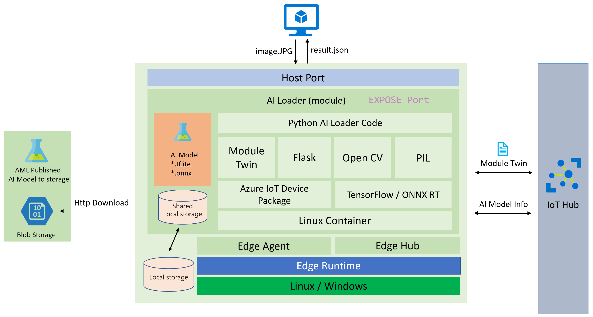

# How to enable AI Model on Azure IoT Edge device

## Background

One of the most popular Edge scenarios is the artificial intelligence (AI) on Edge (Image Classification, Object Detection, Body, Face & Gesture Analysis, Image Manipulation, ETC ... ). Azure IoT Edge can certainly support these scenarios, These AI ability can also be improve over the model update, but in some scenarios the Edge device network environment is not good, Especially for some manufacturing equipment (such us wind power or oil exploitation), in the desert or at sea.

However, as you know, Azure IoT Edge Module is the basis on docker. In generally an Edge module with AI environment image the size will be around GB level at least, so how to incremental updates to the AI model in a narrow bandwidth network its becomes more meaningful. This is the reason I made this code example. I have made a Edge AI loader module which can load Object Detection TensorFlow or ONNX AI models and enable this AI module as a WebAPI.

## Overview

This Edge AI loader module architecture please refer below

